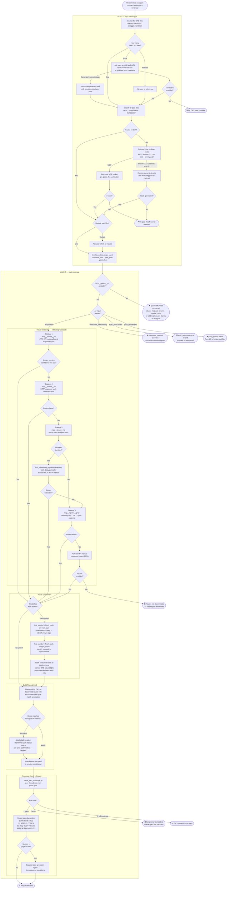

# Pact Coverage Flow

```mermaid
flowchart TD
    START([User invokes swagger-contract-testing:pact-coverage])

    subgraph SKILL["SKILL — Input Resolution"]
        FIND_OAS[Search for OAS files\nopenapi.yaml/json · swagger.yaml/json]
        OAS_COUNT{How many\nvalid OAS files?}
        OAS_ASK[Ask user: provide path/URL\nfetch from PactFlow\nor generate from codebase]
        OAS_GIVEN{Valid spec\nprovided?}
        OAS_GEN[Invoke oas-generator skill\nwith provider codebase path]
        OAS_PICK[Ask user to select one]
        FIND_PACTS[Search for pact files\npacts/ · target/pacts/ · build/pacts/]
        PACT_DISK{Found on disk?}
        PACT_HOW[Ask user how to obtain pacts\nMCP · broker CLI · run tests · specify path]
        BROKER[Fetch via MCP broker\nget_pacts_for_verification]
        BROKER_OK{Found?}
        RUN_TESTS[Run consumer test suite\nfiles matching pact or contract]
        TESTS_OK{Pacts generated?}
        PACT_SEL{Multiple pact files?}
        PACT_PICK[Ask user which to include]
        INVOKE[Invoke pact-coverage agent\nconsumer_root · spec_path · pact_glob]

        FIND_OAS --> OAS_COUNT
        OAS_COUNT -- None --> OAS_ASK --> OAS_GIVEN
        OAS_ASK -- Generate from codebase --> OAS_GEN --> FIND_PACTS
        OAS_COUNT -- One --> FIND_PACTS
        OAS_COUNT -- Multiple --> OAS_PICK --> FIND_PACTS
        OAS_GIVEN -- Yes --> FIND_PACTS
        FIND_PACTS --> PACT_DISK
        PACT_DISK -- Yes --> PACT_SEL
        PACT_DISK -- No --> PACT_HOW
        PACT_HOW -- MCP --> BROKER --> BROKER_OK
        PACT_HOW -- broker CLI / run tests / specify --> RUN_TESTS --> TESTS_OK
        BROKER_OK -- Yes --> PACT_SEL
        BROKER_OK -- No --> STOP_PACTS
        TESTS_OK -- Yes --> PACT_SEL
        PACT_SEL -- One --> INVOKE
        PACT_SEL -- Multiple --> PACT_PICK --> INVOKE
    end

    subgraph AGENT["AGENT — pact-coverage"]
        MCP_CHECK{mcp__ripwire__for\navailable?}
        INPUT_CHECK{All inputs\npresent?}

        subgraph DISC["Route Discovery — 4-Strategy Cascade"]
            S1["Strategy 1\nmcp__ripwire__for\nHTTP API route calls and response types"]
            S1_OK{Routes found &\nconfidence not low?}
            S2["Strategy 2\nmcp__ripwire__for\nHTTP response body deserialization"]
            S2_OK{Routes found?}
            S3["Strategy 3\nmcp__ripwire__for\nHTTP client wrapper class"]
            S3_WRAP{Wrapper\nidentified?}
            S3_WALK["find_referencing_symbols(wrapper)\nfetch_body per caller\nextract URL + HTTP method"]
            S3_ROK{Routes\nextracted?}
            S4["Strategy 4\nmcp__ripwire__grep\nNewRequest · 'GET' '/path' patterns"]
            S4_OK{Routes found?}
            MANUAL[Ask user for manual\nconsumer-routes JSON]
            MANUAL_OK{Routes\nprovided?}

            S1 --> S1_OK
            S1_OK -- No --> S2
            S2 --> S2_OK
            S2_OK -- No --> S3
            S3 --> S3_WRAP
            S3_WRAP -- Yes --> S3_WALK --> S3_ROK
            S3_WRAP -- No --> S4
            S3_ROK -- No --> S4
            S4 --> S4_OK
            S4_OK -- No --> MANUAL --> MANUAL_OK
        end

        subgraph ENRICH["Route Enrichment"]
            SYM_CHECK{Route has\nfrom symbol?}
            FETCH_FN["find_symbol + fetch_body on from_sym\nRead function body → identify return type"]
            FETCH_TYPE["find_symbol + fetch_body on type_name\nIdentify required vs optional fields"]
            NARROW["Match consumer fields to OAS schema\nNarrow OAS required[] to\nconsumer-declared fields only"]

            SYM_CHECK -- Has symbol --> FETCH_FN --> FETCH_TYPE --> NARROW
        end

        subgraph FILTER["Build Filtered OAS"]
            BUILD_OAS["Filter provider OAS to\ndiscovered routes only\nadd x-consumer-type-match annotation"]
            ROUTE_MATCH{Route matches\nOAS path + method?}
            WARN["WARNING to stderr\nMETHOD /path did not match\nany OAS path/method — skipped"]
            WRITE_OAS[Write filtered-oas.yaml\nto session scratchpad]

            BUILD_OAS --> ROUTE_MATCH
            ROUTE_MATCH -- No match --> WARN --> WRITE_OAS
            ROUTE_MATCH -- Match --> WRITE_OAS
        end

        subgraph COV["Coverage Check + Report"]
            RUN_COV["parse_pact_coverage.py\n--spec filtered-oas.yaml --pacts glob"]
            EXIT_CODE{Exit code?}
            REPORT["Report gaps by section\n§1 PATH/METHOD\n§2 STATUS CODES\n§3 REQ BODY FIELDS\n§4 RESP BODY FIELDS"]
            SEC1_GAP{Section 1\ngaps found?}
            SUGGEST["Suggest pact-generator agent\nfor uncovered operations"]

            RUN_COV --> EXIT_CODE
            EXIT_CODE -- 1 gaps --> REPORT --> SEC1_GAP
            SEC1_GAP -- Yes --> SUGGEST
        end

        MCP_CHECK -- Yes --> INPUT_CHECK
    end

    TESTS_OK -- No --> STOP_PACTS

    %% Stop / success nodes
    STOP_OAS(["❌ No OAS spec provided"])
    STOP_PACTS(["❌ No pact files found or obtained"])
    STOP_MCP(["❌ ripwire MCP not connected\nclaude mcp add ripwire -- ripwire --mcp\nor add mcpServers stanza to mcp.json"])
    STOP_CR(["❌ consumer_root not provided\nRun skill to resolve inputs"])
    STOP_SP(["❌ spec_path missing or invalid\nRun skill to select OAS"])
    STOP_PG(["❌ pact_glob no match\nRun skill to locate pact files"])
    STOP_ROUTES(["❌ Routes not discoverable\nAll 4 strategies exhausted"])
    STOP_SCRIPT(["❌ Script error exit code 2\nCheck spec and pact files"])
    DONE_FULL(["✅ Full coverage — no gaps"])
    DONE_GAPS(["✅ Report delivered"])

    %% Cross-subgraph edges
    START --> FIND_OAS
    OAS_GIVEN -- No --> STOP_OAS
    INVOKE --> MCP_CHECK
    MCP_CHECK -- No --> STOP_MCP
    INPUT_CHECK -- consumer_root missing --> STOP_CR
    INPUT_CHECK -- spec_path invalid --> STOP_SP
    INPUT_CHECK -- pact_glob empty --> STOP_PG
    INPUT_CHECK -- All present --> S1
    S1_OK -- Yes --> SYM_CHECK
    S2_OK -- Yes --> SYM_CHECK
    S3_ROK -- Yes --> SYM_CHECK
    S4_OK -- Yes --> SYM_CHECK
    MANUAL_OK -- Yes --> SYM_CHECK
    MANUAL_OK -- No --> STOP_ROUTES
    SYM_CHECK -- No symbol --> BUILD_OAS
    NARROW --> BUILD_OAS
    WRITE_OAS --> RUN_COV
    EXIT_CODE -- 0 full coverage --> DONE_FULL
    EXIT_CODE -- 2 error --> STOP_SCRIPT
    SEC1_GAP -- No --> DONE_GAPS
    SUGGEST --> DONE_GAPS
```
